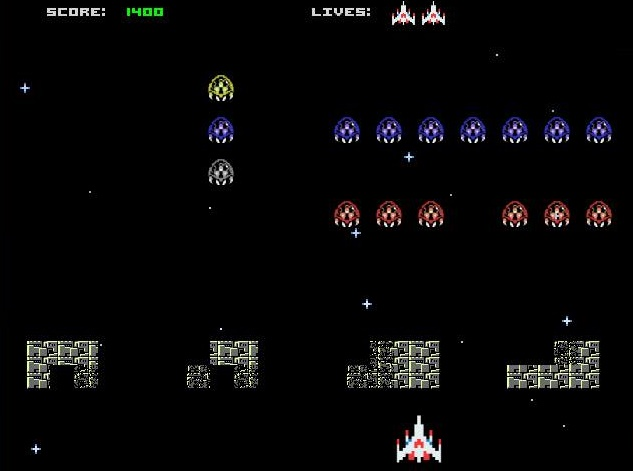

# space-monogatari
> Projeto da disciplina de Computação I 2015/1 do curso de Ciência da Computação UFRJ.

## objetivo
Desenvolver uma recriação do jogo 'Space Invaders', utilizando a linguagem *C* com orientação a objetos e a biblioteca gráfica *Allegro 5.0*. Os seguintes objetos devem ser obrigatoriamente implementados no jogo:
- Player (nave/tanque): anda, atira, morre
- Aliens: anda, atira, morre
- Projéteis: anda
- Nave-mãe: anda, atira, morre
- Shields (escudos/bunkers): toma tiro, fica danificado
- HUD: apresenta pontuação, vidas

## informações
- Professor: Geraldo Zimbrão
- Estudantes: Vinícius Garcia, Júlio Rama, Diego Souza

## imagens

